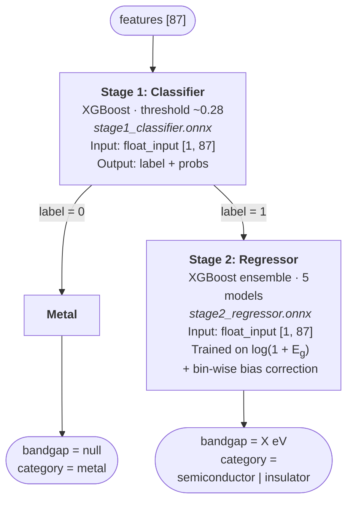

# CrystaLogiX — Inference Server

> FastAPI + ONNX inference backend for the CrystaLogiX bandgap prediction system. Deployed on Render, called exclusively by the Next.js server — never directly from the browser.

---

## Overview

This server hosts the two-stage XGBoost prediction pipeline exported to ONNX format. It receives a 87-element feature vector, runs a metal/non-metal classifier, and — for non-metals — runs a bandgap regressor returning energy in eV.

It is a **private server**: CORS is locked to the Netlify frontend domain, and every prediction endpoint requires a shared secret via `x-api-key`. The Next.js backend injects this key server-side; it never reaches the browser.

---

## Endpoints

| Method | Path           | Auth        | Description                  |
| ------ | -------------- | ----------- | ---------------------------- |
| `GET`  | `/`            | None        | Welcome message              |
| `GET`  | `/api/health`  | None        | Model load status            |
| `POST` | `/api/predict` | `x-api-key` | Two-stage bandgap prediction |

---

### `GET /api/health`

Used by the Next.js `/api/health` route to probe whether the inference server is live and models are loaded.

**Response:**

```json
{ "status": "ok", "models_loaded": true }
```

---

### `POST /api/predict`

**Headers:**

```
Content-Type: application/json
x-api-key: <API_SECRET_KEY>
```

**Request body:**

```json
{
  "features": [4.0, 3.85, 6.431, 15.0, "..."]
}
```

- Must be exactly **87 floats**
- All values must be finite numbers
- Missing or wrong-length arrays return `400`
- Missing or wrong key returns `401` (not `422` — see [Auth](#auth))

**Response — metal:**

```json
{
  "stage1": {
    "is_metal": true,
    "class_label": 0,
    "prob_metal": 0.996804,
    "prob_non_metal": 0.003196
  },
  "stage2": {
    "bandgap_ev": null,
    "bandgap_category": "metal"
  }
}
```

**Response — non-metal:**

```json
{
  "stage1": {
    "is_metal": false,
    "class_label": 1,
    "prob_metal": 0.003196,
    "prob_non_metal": 0.996804
  },
  "stage2": {
    "bandgap_ev": 1.4823,
    "bandgap_category": "semiconductor"
  }
}
```

`bandgap_category` is one of:

- `"metal"` — Stage 1 predicted metal, Stage 2 not run
- `"semiconductor"` — bandgap < 3.0 eV
- `"insulator"` — bandgap ≥ 3.0 eV

---

## Auth

Authentication uses a single shared secret passed as the `x-api-key` header.

```python
def verify_key(x_api_key: str = Header(default=None)):
    if not x_api_key or x_api_key != API_KEY:
        raise HTTPException(status_code=401, detail="Invalid API key.")
```

`Header(default=None)` is intentional — it ensures a **missing** header returns `401` rather than FastAPI's default `422 Unprocessable Entity`, which would leak that the header exists.

| Condition                   | Status |
| --------------------------- | ------ |
| Header present, key correct | `200`  |
| Header present, key wrong   | `401`  |
| Header absent               | `401`  |

---

## Two-Stage Pipeline



### ONNX Model Specs

| Model      | File                     | Input node    | Input shape | Output                                    |
| ---------- | ------------------------ | ------------- | ----------- | ----------------------------------------- |
| Classifier | `stage1_classifier.onnx` | `float_input` | `[1, 87]`   | `label (int)`, `probabilities (float[2])` |
| Regressor  | `stage2_regressor.onnx`  | `float_input` | `[1, 87]`   | `bandgap_ev (float)`                      |

---

## Features

The 87 features are Magpie-style compositional descriptors derived from crystal structure and elemental properties:

- Elemental statistics (mean, range, min, max, std) over: atomic number, atomic weight, electronegativity, atomic radius, melting point, oxidation states
- Thermodynamic properties: formation energy proxies, cohesive energy estimates
- Structural: number of unique elements, compound stoichiometry

Features are ordered — the Next.js `/api/get-label` route returns them in the same order expected here. Do not reorder.

Full feature list and ordering: `GET /api/features` on the Next.js app.

---

## Error Codes

| Status | Cause                                                        |
| ------ | ------------------------------------------------------------ |
| `400`  | Feature count ≠ 87                                           |
| `401`  | Missing or invalid `x-api-key`                               |
| `422`  | Body is not valid JSON or `features` key is missing entirely |
| `500`  | ONNX runtime threw during inference                          |

---

## Security Notes

- CORS is locked to `https://crystalogix.netlify.app` — browser requests from any other origin are blocked
- `x-api-key` is only ever sent **server-to-server** (Next.js → Render) — it is never in any client bundle
- The server hard-fails at startup if `API_SECRET_KEY` is not set (`os.environ["API_SECRET_KEY"]` raises `KeyError`)
- Models are loaded once at startup — a missing `.onnx` file raises `RuntimeError` immediately, not silently at inference time

---

## File Structure

```
backend/
├── inference_server.py         # Main FastAPI application
└── models/
    ├── stage1_classifier.onnx  # XGBoost classifier (metal vs non-metal)
    └── stage2_regressor.onnx   # XGBoost regressor (bandgap eV)
```
